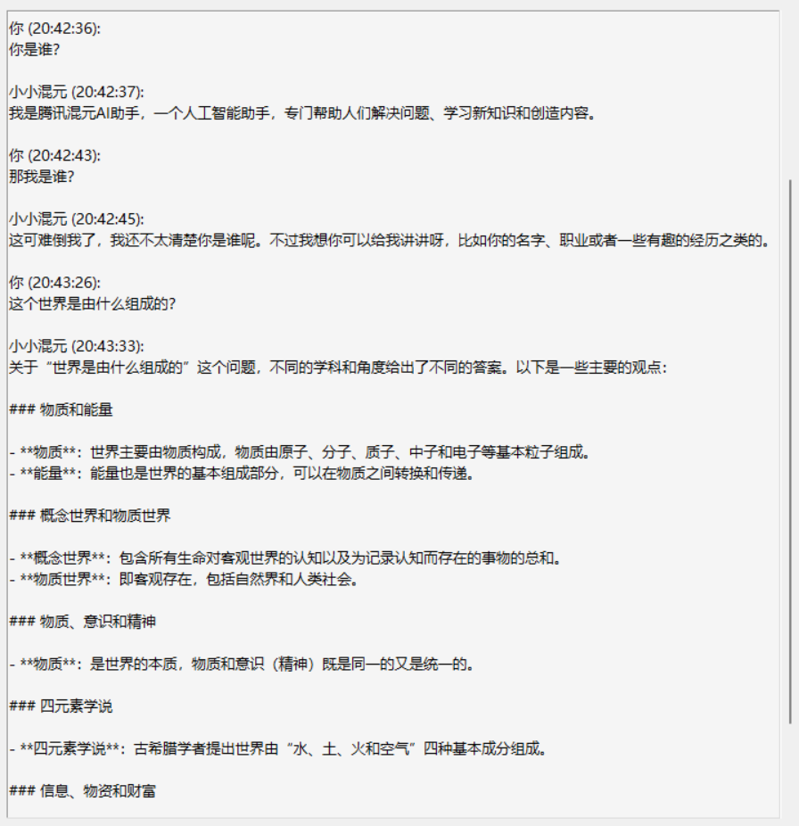
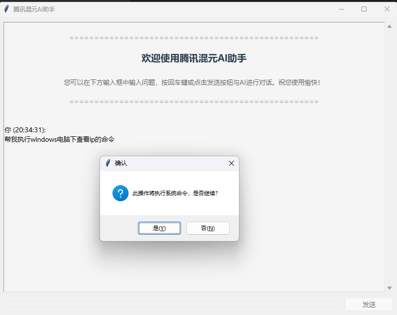
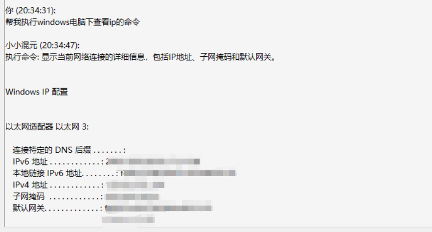

# 一个傻到不行的调用API来运行本地命令的初步尝试

基本完成一个简陋的页面和没钱玩家调用免费API来实现虚假的命令执行

如何使用：
1. 直接安装好相应的库函数
2. 申请某大模型的API
3. 进入CONFIG.py文件进行配置
4. 运行main.py文件即可

功能就是：
1. 完成基本大模型对话
2. 自然语言交流随机性的、很怪异的完成本地的命令执行

限制：
1. 此API并没有上下文记忆和微调等功能
2. 有些命令想执行都无法执行，有道德模块限制，即使识别为命令也不会搞里头
3. 识别度不高，想要完整的还得是本地自建大模型然后接口调过来
4. 没啥技术含量的小玩意

**和大模型对话**

进行命令运行

然后生成如下结果

很捞，还是看一下大佬怎么实现的吧